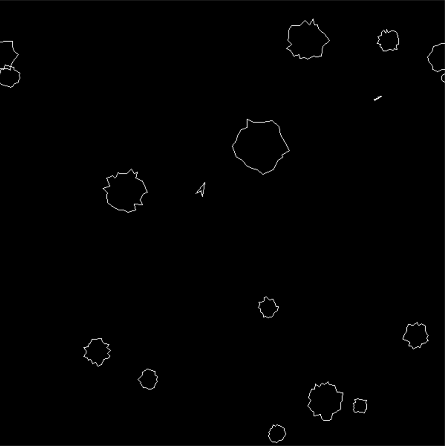

# Foxtroids

A simple asteroids alike game I am building to practice my programming and gamemaking skills.

# To Install

  -Make sure you have rust installed  
  -Clone the repository  
  -Open your command prompt  
  -Use the command prompt to choose the cloned repository's directory  
  -Type "cargo run"  

# Controls

  - W = Thrust
  - S = Reverse
  - A = Rotate Left (CCW)
  - D = Rotate Right (CW)
  - Space = Shoot
  - Esc = Quit
